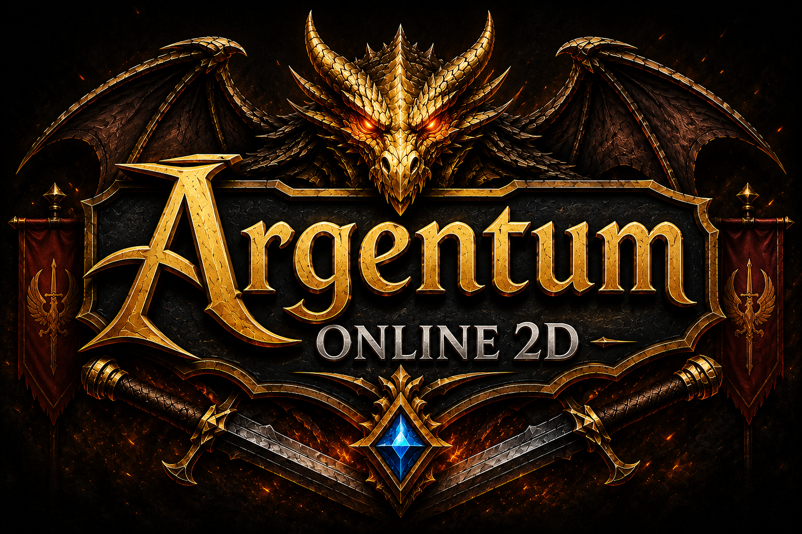
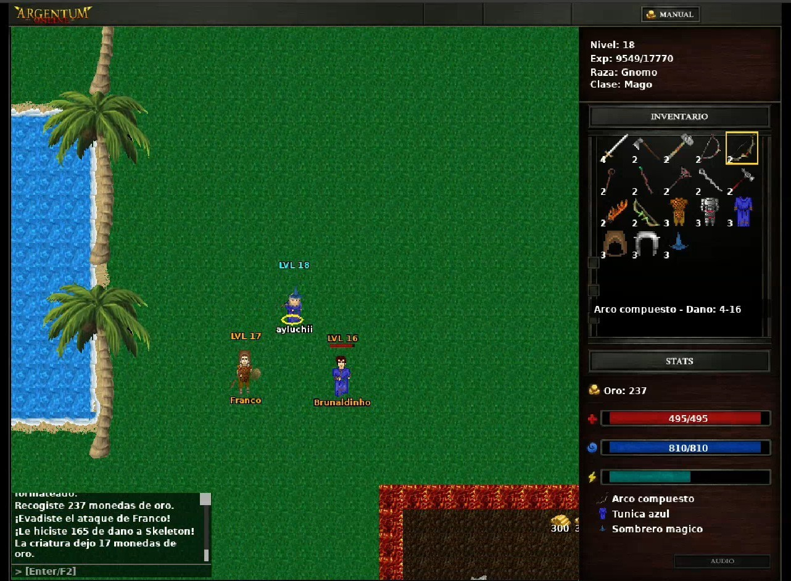
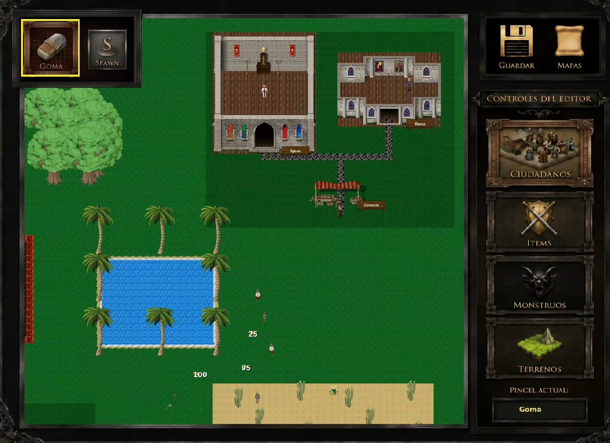

# Argentum Online

<p align="center">
  
</p>

<p align="center">
  
  
</p>
<p align="center">
  <sub><i>Izquierda: Interfaz del Cliente de Juego. Derecha: Vista general del Editor de Mapas.</i></sub>
</p>

Trabajo Práctico Final de **Taller de Programación** (FIUBA): un juego
multijugador en red basado en *Argentum Online*. Varios jugadores se conectan a
un mismo servidor y comparten el mundo en tiempo real. El proyecto incluye el
cliente gráfico (SDL2 con launcher en Qt5), el servidor de juego y un editor de
mapas.

## Integrantes

- Aylén Bartomeo — 111738
- Franco Bustos — 110759
- Alexander Coronado — 111256
- Bruno Pezman — 110457

## Estructura del proyecto

```
client/      Cliente gráfico (SDL2 + launcher Qt5)
server/      Servidor de juego
editor/      Editor de mapas
common/      Código compartido (protocolo, sockets, DTOs, etc.)
tests/       Tests (GoogleTest)
config/      Archivos de configuracion del juego
documents/   Enunciado y manuales del juego
maps/        Mapas en JSON (mapa canónico: maps/defaultMap.json)
resources/   Assets gráficos del cliente y el editor
```

## Dependencias

Requiere **CMake ≥ 3.24** y un compilador con **C++20** (gcc/g++).

Antes de compilar hay que instalar a mano algunos paquetes del sistema. En
Ubuntu / Xubuntu 24.04:

```bash
sudo apt-get install qtbase5-dev qtbase5-dev-tools \
  libopus-dev libopusfile-dev libxmp-dev libfluidsynth-dev fluidsynth \
  libwavpack1 libwavpack-dev libfreetype-dev wavpack
```

- `qtbase5-dev` / `qtbase5-dev-tools`: requeridos por el launcher del cliente (Qt5).
- El resto son dependencias de audio/fuentes de SDL2.

SDL2, SDL2pp, SDL2_image, SDL2_mixer, SDL2_ttf, toml++, nlohmann_json, bcrypt y
GoogleTest se descargan y compilan automáticamente vía FetchContent; **no** hace
falta instalarlos a mano.

## Compilación

Todo se ejecuta **parado en la raíz del proyecto**. El `Makefile` resuelve los
casos más comunes:

| Comando | Qué hace |
|---|---|
| Instalar dependencias | `make install` |
| Desinstalar | `make uninstall` |
| Compilar (debug) | `make compile-debug` |
| Correr tests | `make run-tests` |
| Tests con Valgrind (reporte en `build/valgrind`) | `make valgrind-tests` |
| Limpiar `build/` | `make clean` |
| Recompilar + tests | `make all` |

> Al desinstalar se preguntará si conservar la base de datos y la carpeta `build/`.

---

## Configuración

El archivo de configuración central se ubica en:

```
~/.config/argentum_online/config/config.toml
```

Parámetros principales: `port` (TCP), `world` (nombre del mundo activo), `map` (archivo `.map` inicial).

Los assets estáticos se despliegan en `~/.local/share/argentum_online/`, con la siguiente estructura:

- `maps/` — mapas y matrices de terreno
- `resources/` — sprites, GUI, fuentes y audio
- `game_data/` — tablas de balance, ítems, NPCs (YAML)

---

## Uso del Sistema

### Servidor

```bash
make run-server-create                              # Nuevo mundo con valores por defecto
make run-server-create 8080 "MiMundo" "maps/x.json" # Mundo personalizado
make run-server-load                                # Cargar mundo existente
make valgrind-server                                # Servidor con Valgrind
```

Ejecución global: `argentum_online_server <puerto> --load <nombre_mundo>`

**Base de datos:**

```bash
make clean-db-auth    # Borra cuentas y personajes
make clean-db-world   # Borra mundos guardados
make clean-db         # Borra todo
```

### Cliente

```bash
make run-client                          # Desarrollo estándar
make run-client ARGS="-- fullscreen"     # Pantalla completa
make run-client ARGS="--width 1080 --height 720"
```

Ejecución global: `argentum_online_client` (pantalla completa por defecto desde ícono de escritorio).

### Editor de Mapas

```bash
make run-editor          # Local
argentum_online_editor   # Global
```

---

#### Conexión al host

Al abrirse la ventana del juego, la primera pantalla solicita la IP y el puerto
del servidor.

- **IP:** `127.0.0.1` (o `localhost` si están en la misma máquina).
- **Puerto:** `8080` (o el mismo que se usó en el Paso 2).

Validaciones en esta etapa:

- Si ingresás un puerto o IP donde no hay ningún servidor corriendo, el juego
  rechaza la conexión (no te deja avanzar a la siguiente pantalla).
- Solo avanza cuando logra establecer el *handshake* inicial con el servidor.

## Autenticación (login / registro)

Una vez conectados al servidor, aparece la pantalla de autenticación, con dos
opciones:

**Opción A — Registrar un nuevo jugador:**

1. Ingresá un nombre de usuario y contraseña inventados.
2. Hacé clic en **Sign Up (Register)**.
3. Validaciones: si el nombre de usuario ya existe en `auth_data/`, el servidor
   rechaza la solicitud y hay que elegir otro nombre. Si es nuevo, crea la cuenta
   y entrás al juego directamente.

**Opción B — Iniciar sesión (login):**

1. Ingresá tu nombre de usuario y contraseña existentes.
2. Hacé clic en **Sign In (Login)**.
3. Validaciones:
   - El servidor verifica los datos. Si el usuario no existe, o la contraseña es
     incorrecta, la solicitud es rechazada.
   - **Sesión múltiple:** si los datos son correctos pero ese usuario *ya está
     conectado dentro del juego*, el servidor bloquea el acceso para evitar
     jugadores duplicados.
   - Si todo es correcto y la cuenta no está en uso, ingresás al mundo.

---

## Controles en Juego

| Tecla / Acción | Efecto |
|---|---|
| `W` `A` `S` `D` | Mover personaje |
| Click izquierdo | Interactuar / atacar cuerpo a cuerpo |
| Doble click izquierdo | Equipar/desequipar ítem del inventario |
| Click derecho | Disparar proyectil o lanzar hechizo |
| `Enter` | Abrir/enviar chat |
| `Esc` | Salir (abre confirmación) |
| `F2` | Mostrar/ocultar ventana de chat |

---

## Comandos de Chat

Abrir con `Enter`, escribir y confirmar con `Enter`.

**Generales:** `/tomar` · `/meditar` · `/resucitar`  
**Mensajería privada:** `@<nick> <mensaje>`

**NPCs** (Banquero / Comerciante / Sacerdote — requiere estar cerca y hacer click):

`/listar` · `/comprar <item>` · `/vender <item>` · `/curar`  
`/depositar <item|oro <cantidad>>` · `/retirar <item|oro <cantidad>>`

**Clanes:**

`/fundar-clan <nombre>` · `/unirse <clan>` · `/dejar-clan`  
`/revisar-clan` · `/clan-aceptar|rechazar|kick|ban <nick>` *(solo líderes)*

---

## Cheats / Administrador

Mantener `Shift` + letra:

| Atajo | Efecto |
|---|---|
| `Shift+L` | Subir nivel |
| `Shift+K` | Morir (kill) |
| `Shift+B` | Arco en inventario |
| `Shift+M` | Maná infinito |
| `Shift+H` | Vida infinita |
| `Shift+G` | Oro en inventario |
| `Shift+P` | Set de pociones |
| `Shift+A` | Armaduras |
| `Shift+W` | Armas y munición |

> Reservados para QA y testeo de balance en entornos controlados.

---

## Funcionalidades Pasivas

- **Spawn:** primera conexión posiciona al personaje en el spawn point del mapa.
- **Autoguardado:** cada 30 segundos el Game Loop persiste posición y stats de todos los jugadores activos.
- **Desconexión segura:** al cerrar el cliente se fuerza un guardado atómico inmediato.
- **Reconexión determinista:** al volver a ingresar, el personaje reaparece en la tile exacta donde estaba.
- **Persistencia Cuenta-Mundo:** cada cuenta tiene estados independientes por mundo.

---

## Editor de Mapas

- **Pintar terreno:** seleccionar tile de la paleta derecha → click izquierdo sobre la grilla.
- **Herramientas** (borde amarillo = activa): **Pincel** (pintar textura) · **Spawn** (definir punto de inicio).
- **Navegar:** flechas del teclado o arrastrar con click derecho.
- **Guardar:** botón verde o tecla `S`. El título indica `"* sin guardar"` si hay cambios pendientes.

Salida en: `maps/defaultMap.json`

---

## Salir del Juego

Cerrar la ventana (×) o presionar `Esc` abre un diálogo de confirmación: **Aceptar** para salir o **Volver** para continuar. Luego cerrar el servidor con `q` + `Enter` en su terminal.

## Documentacion
Dentro de la carpeta ***documentation*** se encuentran los 3 manuales del juego y el enunciado del mismo.

- [Enunciado Argentum Online](documents/enunciado.pdf).
- 'Manual de Usuario'.
- 'Informe Técnico'.
- 'Informe del Proyecto'.

## Créditos
Se han usado las siguiente bibliotecas desarrolladas por [Di Paola, Martin](https://www.github.com/eldipa):

- 'Socket'.
- 'Resolver'.
- 'ResolverError'.
- 'LibError'.
- 'Queue'.
- 'Thread'.
